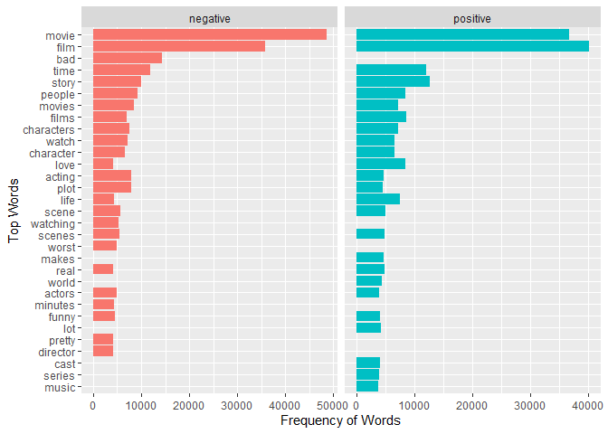

Word_Frequency_Analysis
================
Naga Vemprala
2023-04-25

## Text Analytics/Text Mining using R

> This markdown file demonstrates applications of text data and the
> significance of analyzing text data for organizational
> decision-making. Text data is widely available in an unstructured
> format in the form of customer reviews, news articles, blog posts,
> social media data, and contracts. Along with operational data, text
> data is crucial for organizations’ decision-making processes. While
> drawing insights using the text data, the markdown also introduces
> data manipulation, cleansing, and utilization of some key data formats
> within text mining applications. This course also covers the data
> representation of text in machine learning algorithms and how this
> method can be extended to more complex applications, including topic
> models, clustering, word2vec, and other deep learning-based
> techniques, primarily through the R programming language.

## Steps Involved in the frequency based analysis

1.  Text Pre-Processing
    - Remove line breaks
    - Remove special characters
    - Remove double quotation marks
    - Remove patterns such as a), i), \$900 (dollar figures),
    - Convert the upper case strings to lower case
2.  Display a couple of sample reviews
3.  Convert all strings to individual word tokens & plot visualizations
    (Top words with frequency and wordclouds)
4.  Extracting latent topics
    - LSA
    - LDA

#### 1. Text Pre-Processing

``` r
IMDB_Reviews <- IMDB_Reviews %>%
    mutate(review = str_replace_all(review, "<br />", " ")) %>%
    mutate(review = str_remove_all(review, "[!@#%^*-?'&,+]")) %>%
    mutate(review = str_remove_all(review, '\"')) %>%
    mutate(review = str_replace_all(review, '\\.', " ")) %>%
    mutate(review = str_remove_all(review, "[:punct:]")) %>%
    mutate(review = str_squish(review)) %>%
    mutate(review = str_to_lower(review))
```

#### 2. Display a couple of sample reviews

``` r
print(IMDB_Reviews[34,1])
```

    ## # A tibble: 1 × 1
    ##   review                                                                        
    ##   <chr>                                                                         
    ## 1 one of the most significant quotes from the entire film is pronounced halfway…

``` r
print(IMDB_Reviews[54,1])
```

    ## # A tibble: 1 × 1
    ##   review                                                                        
    ##   <chr>                                                                         
    ## 1 i cannot believe i enjoyed this as much as i did the anthology stories were b…

#### 3. Convert all strings to individual word tokens

``` r
contractions <- data.frame(word = c("doesnt", "dont", "didnt", "im"))
frequency_sentiment_words <- union_all(IMDB_Reviews %>%
                                           unnest_tokens(word, review) %>%
                                           anti_join(stop_words) %>%
                                           anti_join(contractions) %>%
                                           filter(sentiment == "positive") %>%
                                           count(word, sentiment, sort = TRUE) %>%
                                           ungroup() %>% 
                                           mutate(word_num = row_number()) %>%
                                           filter(word_num <= 25)
                                       ,
                                       IMDB_Reviews %>%
                                           unnest_tokens(word, review) %>%
                                           anti_join(stop_words) %>%
                                           anti_join(contractions) %>%
                                           filter(sentiment == "negative") %>%
                                           count(word, sentiment, sort = TRUE) %>%
                                           ungroup() %>%
                                           mutate(word_num = row_number()) %>%
                                           filter(word_num <= 25)) 
ggplot(frequency_sentiment_words) +
    geom_bar(aes(x = reorder(word, n), y = n,
                 fill = sentiment), stat = "identity",
             show.legend = FALSE) + 
    facet_grid(~sentiment, scales="free") + 
    coord_flip() + 
    labs( y = "Frequency of Words", x = "Top Words")
```

<!-- -->

#### Create a positive reviews wordcloud

``` r
#wordcloud2(frequency_sentiment_words)
wordcloud(frequency_sentiment_words$word,
          frequency_sentiment_words$n,
          random.color=TRUE)
```

<!-- -->

#### Create a negative reviews wordcloud

``` r
wordcloud(frequency_sentiment_words$word,
          frequency_sentiment_words$n,
          random.color=TRUE)
```

<!-- -->

#### Topic models

> Extract topics from the positive reviews first

``` r
lda_textmineR <- FitLdaModel(
  xdtm,
  k = 5,
  iterations = 500,
  burnin = 200, # Hyper - parameters 
  alpha = 0.1,
  beta = 0.05,
  optimize_alpha = T,
  calc_likelihood = T,
  calc_coherence = TRUE,
  calc_r2 = T,
)
```

> Top 15 terms per topic in the positive reviews

``` r
lda_textmineR$top_Terms <- GetTopTerms(lda_textmineR$phi, 15, return_matrix = TRUE)
lda_textmineR$top_Terms
```

    ##       t_1      t_2          t_3           t_4         t_5         
    ##  [1,] "war"    "movie"      "film"        "life"      "film"      
    ##  [2,] "game"   "good"       "good"        "story"     "films"     
    ##  [3,] "city"   "great"      "horror"      "people"    "story"     
    ##  [4,] "police" "movies"     "films"       "film"      "time"      
    ##  [5,] "time"   "time"       "great"       "world"     "characters"
    ##  [6,] "series" "watch"      "man"         "man"       "great"     
    ##  [7,] "man"    "show"       "role"        "love"      "music"     
    ##  [8,] "york"   "dont"       "character"   "young"     "work"      
    ##  [9,] "big"    "people"     "john"        "movie"     "beautiful" 
    ## [10,] "back"   "funny"      "cast"        "family"    "made"      
    ## [11,] "plot"   "love"       "plays"       "find"      "director"  
    ## [12,] "dance"  "characters" "performance" "character" "scenes"    
    ## [13,] "films"  "watching"   "story"       "mother"    "cinema"    
    ## [14,] "hes"    "im"         "pretty"      "real"      "movie"     
    ## [15,] "black"  "lot"        "young"       "human"     "love"

> Plot the clusters and see how they are related

``` r
lda_textmineR$linguistic <- CalcHellingerDist(lda_textmineR$phi)
lda_textmineR$hclust <- hclust(as.dist(lda_textmineR$linguistic),"ward.D") # Clustering 
lda_textmineR$hclust$labels <- paste(lda_textmineR$hclust$labels, lda_textmineR$labels[,1])
plot(lda_textmineR$hclust, 
     xlab = "Topic",
     ylab = "Topic coherence")
```

<!-- -->

> Extract topics from the negative reviews

``` r
lda_textmineR <- FitLdaModel(
  xdtm,
  k = 5,
  iterations = 500,
  burnin = 200, # Hyper - parameters 
  alpha = 0.1,
  beta = 0.05,
  optimize_alpha = T,
  calc_likelihood = T,
  calc_coherence = TRUE,
  calc_r2 = T,
)
```

> Top 15 terms per topic in the negative reviews

``` r
lda_textmineR$top_Terms <- GetTopTerms(lda_textmineR$phi, 15, return_matrix = TRUE)
lda_textmineR$top_Terms
```

    ##       t_1         t_2        t_3       t_4          t_5         
    ##  [1,] "story"     "movie"    "film"    "film"       "show"      
    ##  [2,] "time"      "bad"      "people"  "story"      "people"    
    ##  [3,] "hes"       "good"     "films"   "films"      "series"    
    ##  [4,] "â"         "film"     "horror"  "good"       "time"      
    ##  [5,] "scene"     "movies"   "sex"     "characters" "shows"     
    ##  [6,] "wife"      "dont"     "scenes"  "character"  "tv"        
    ##  [7,] "man"       "watch"    "doesnt"  "director"   "movie"     
    ##  [8,] "plot"      "time"     "man"     "great"      "back"      
    ##  [9,] "end"       "plot"     "scene"   "made"       "good"      
    ## [10,] "character" "acting"   "dont"    "script"     "years"     
    ## [11,] "action"    "made"     "bad"     "actors"     "funny"     
    ## [12,] "young"     "make"     "make"    "love"       "episode"   
    ## [13,] "woman"     "worst"    "lot"     "cast"       "made"      
    ## [14,] "doesnt"    "watching" "thing"   "role"       "dont"      
    ## [15,] "point"     "im"       "minutes" "work"       "characters"

> Plot the clusters and see how they are related

``` r
lda_textmineR$linguistic <- CalcHellingerDist(lda_textmineR$phi)
lda_textmineR$hclust <- hclust(as.dist(lda_textmineR$linguistic),"ward.D") # Clustering 
lda_textmineR$hclust$labels <- paste(lda_textmineR$hclust$labels, lda_textmineR$labels[,1])
plot(lda_textmineR$hclust, 
     xlab = "Topic",
     ylab = "Topic coherence")
```

<!-- -->
