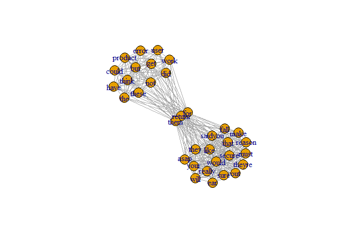

Text Data Visualizations
================
Vemprala
2023-05-23

#### Text Mining Visualizations

Visualizations facilitate the identification of data patterns and
eliminate the need to read interpretation summaries. Also, prior to data
modeling, it is essential to visualize the data to avoid any modeling
issues.

1.  Charts, graphs, and infographics simplify complex data sets. They
    reveal patterns, trends, and relationships in raw data. Users can
    rapidly understand and take conclusions from visualizations.

2.  Decision Making: Visualizing data helps decision makers absorb and
    process information. Visualizations show comparisons and outliers,
    helping stakeholders find areas for development. Visualizations help
    wit the data exploration and improving decision-making.

3.  Communicating Insights: Visualizations help communicate data-driven
    insights. They make information aesthetically appealing and easily
    understandable, facilitating communication. Visualizations make
    complex data and reports easier to understand and remember.

4.  Visualizations help analysts find clusters, correlations, and
    anomalies rapidly by showing data points and patterns.

In this markdown file, some of the commonly used data visualizations
using text data are presented. They include:

1.  Frequency bar plots
2.  Word associations
3.  Word networks
4.  Wordclouds and Wordcloud comparisons

``` r
sentences <- read_xlsx(paste0(getwd(), "/Input/BlutoothSpeaker_B09JB8KPNW.xlsx"))
# Check the dataset and replace NA by spaces 
```

#### Text Pre-processing

-   Text Pre-Processing
-   Remove line breaks
-   Remove special characters
-   Remove double quotation marks
-   Remove extra spaces
-   Convert the upper case strings to lower case
-   removing stopwords

``` r
sentences <- sentences %>%
    mutate(review_text = str_replace_all(review_text, "<br />", " ")) %>%
    mutate(review_text = str_remove_all(review_text, "[!@#%^*-?'&,+]")) %>%
    mutate(review_text = str_remove_all(review_text, '\"')) %>%
    mutate(review_text = str_replace_all(review_text, '\\.', " ")) %>%
    mutate(review_text = str_remove_all(review_text, "[:punct:]")) %>%
    mutate(review_text = str_squish(review_text)) %>%
    mutate(review_text = str_to_lower(review_text))
```

``` r
sentences_stringr_processed <- sentences %>% 
  mutate(sno = row_number()) %>%
  unnest_tokens(word, review_text) %>%
  anti_join(stop_words) %>%
  group_by(sno) %>%
  mutate(review_text = str_c(word, collapse = " ")) %>%
  select(sno, review_text) %>%
  ungroup() %>% # Always add ungroup when group_by is used and done with grouping 
  unique(.)
```

``` r
word_frequencies <- sentences_stringr_processed %>%
  select(review_text) %>%
  unnest_tokens(word, review_text) %>%
  #count(word) 
  group_by(word) %>%
  summarise(frequency = n()) %>%
  ungroup() #  If you forget to ungroup() data, future data management will likely produce errors. One common reason for the error is due to the grouping variables added back to the original dataset even when it is not required in the later analysis. Always ungroup() when you’ve finished with your calculations. 
```

``` r
word_frequencies %>% 
  mutate(word_rank = dense_rank(desc(frequency))) %>%
  arrange(desc(frequency)) %>%
  filter(word_rank <= 20) %>%
  ggplot(aes(x = word, y = frequency)) +
  geom_bar(aes(x = reorder(word, frequency), y = frequency),
           stat = "identity", 
           fill = "blue") + 
  geom_text(aes(label = frequency), vjust = 0, hjust = -0.25, 
            size = 3, colour = "black") +
  coord_flip() + 
  #coord_polar() + 
  labs(x = "word", y = "freq") 
```

<!-- -->

#### Implement text mining (pre-processing and visuliazation) using “tm” package.

``` r
# Create a pre-processing function to reuse the common steps
corpus <- Corpus(VectorSource(sentences$review_text))
customWords <- c("im", "done", "gone")
text_pre_process <- function(corpus) {
  corpus <- tm_map(corpus, tolower)
  corpus <- tm_map(corpus, removeNumbers)
  corpus <- tm_map(corpus, stripWhitespace)
  corpus <- tm_map(corpus, removeWords, customWords)
  corpus <- tm_map(corpus, removeWords, stopwords(kind = "en"))
  return(corpus)
}
corpus <- text_pre_process(corpus)
sentences_tm_processed <- corpus$content
sentences_tm_processed <- as.data.frame(sentences_tm_processed)
names(sentences_tm_processed) <- c("review_text")
sentences_tm_processed$review_text <- str_squish(sentences_tm_processed$review_text)
```

#### In text mining word associations are similar to correlations in quantitative methods.

``` r
tdm <- TermDocumentMatrix(corpus)
word_associations <- findAssocs(tdm, "clarity", 0.25)
word_associations <- as.data.frame(word_associations)
word_associations$terms <- row.names(word_associations)
ggplot(word_associations) +
  geom_point(aes(x = clarity, y = terms))
```

<!-- -->

#### Word association graphs (Usual for social media data analysis)

-   Create adjacency matrix using the reviews that contain returns.

``` r
return_reviews <- sentences[str_detect(sentences_tm_processed$review_text, "return"),]
return_reviews <- return_reviews[str_length(return_reviews$review_text) < 200, ]
return_reviews <- return_reviews[c(1,2),]

return_reviews <- return_reviews[complete.cases(return_reviews$review_text),]
corpus <- Corpus(VectorSource(return_reviews$review_text))
tdm <- TermDocumentMatrix(corpus)
tdm_matrix <- as.matrix(tdm)
adjacency_matrix <- tdm_matrix %*% t(tdm_matrix)
adjacency_matrix <- graph.adjacency(adjacency_matrix, 
                                    weighted = TRUE, 
                                    mode = "undirected", 
                                    diag = TRUE)
adjacency_matrix <- simplify(adjacency_matrix)
plot.igraph(adjacency_matrix)
```

<!-- -->

``` r
return_reviews <- return_reviews[seq(1,5),]
word_network_plot(return_reviews$review_text)
```

<!-- -->

``` r
return_reviews <- sentences[str_detect(sentences_tm_processed$review_text, "return"),]
return_reviews <- return_reviews[str_length(return_reviews$review_text) < 200, ]
return_reviews <- return_reviews[seq(1,5),]
word_associate(return_reviews$review_text, 
               match.string = c("return"), 
               stopwords = Top200Words, network.plot = TRUE)
```

<!-- -->

    ##   row group unit         text                                                                                                                                             
    ## 1   1   all    1         like i saidyou must make sure theyre really secure in your ear as they will fall out for that reason i would return them asap                    
    ## 2   2   all    2         i could not get these to work for me i think it is user error not the product but i did have to return them                                      
    ## 3   3   all    3         bought for my child but her hair is long and that kept messing with the buttons good product i only returned because my daughter couldnt use them
    ## 4   4   all    4         i didnt pay full price for this which if so i would have returned it but for half the price its all right                                        
    ## 5   5   all    5 wife didnt like them but they were ok i returned in original box plus new mailer and didnt receive full refund <U+0001F61E>

``` r
return_reviews <- sentences[str_detect(sentences_tm_processed$review_text, "return"),]
return_reviews %>%
  mutate(reviewId = row_number()) %>%
  unnest_tokens(word, review_text) %>%
  anti_join(stop_words, by = "word") %>%
  pairwise_cor(word, reviewId, sort = T) %>%
  filter( (correlation > 0.8) & (correlation < 0.9) ) %>%
  graph_from_data_frame() %>%
  ggraph(layout = "fr") +
  geom_edge_link(aes(edge_alpha = correlation), show.legend = F) +
  geom_node_point(color = "lightblue", size = 5) +
  geom_node_text(aes(label = name), repel = T) 
```

<!-- -->

``` r
return_reviews <- sentences_tm_processed[str_detect(sentences_tm_processed$review_text, "return"),]
corpus <- Corpus(VectorSource(return_reviews))
tdm <- TermDocumentMatrix(corpus)
tdm_for_hclusters <- removeSparseTerms(tdm, sparse = 0.9)
hclusters <- hclust(dist(tdm_for_hclusters, method = "euclidean"),
                    method = "complete")
plot(hclusters, main = "Cluster of overlapping words by frequencies")
```

<!-- -->
