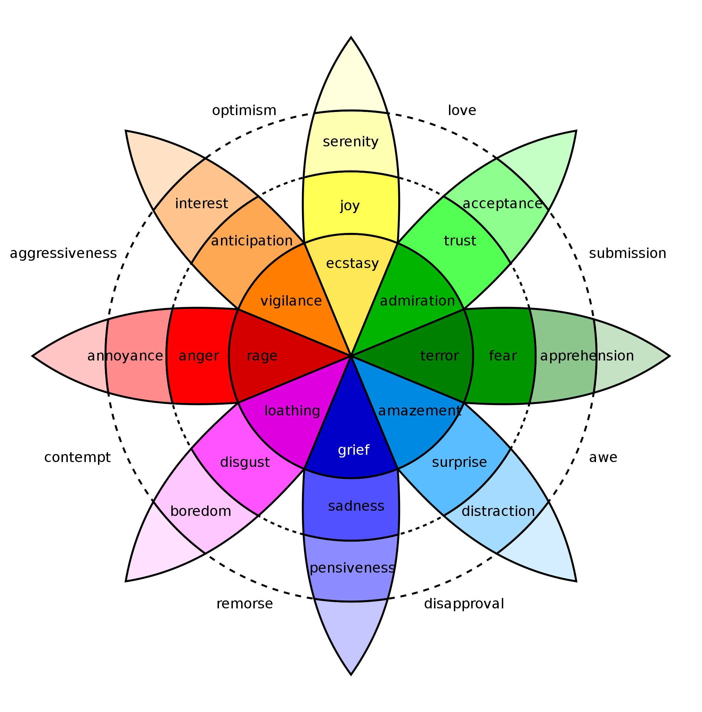

Sentiment Analysis
================
Vemprala
2023-05-25

#### Opinion Mining or Sentiment Analysis & TF-IDF (Term Frequency - Inverse Document Frequency) representation

-   Sentiment Analysis is the process of extracting an author’s
    emotional intent from the text.
-   When more than one topic is discussed in a text and each topic has a
    distinct set of sentiments attached by the author, opinion mining
    becomes quite difficult. Therefore, extracting the topic from the
    text becomes crucial. However, topic extraction necessitates a
    different text representation known as TF-IDF. In favor of
    straightforward term frequency, the TF-IDF value increases with the
    occurrence of the term but is offset by the word’s overall frequency
    in the corpus. The offsetting effect helps in the removal of
    frequently occurring terms that may not provide useful information.
    For instance, if all reviews are about “Batman,” the “Batman”
    keyword will appear in all reviews. The inclusion of “Batman” in the
    analysis would yield no new insights.
-   Sentiment Analysis is based on a framework that classifies a set of
    keywords specific to a sentiment and assigns a score to the level of
    sentiment (emotion) captured by the keywords. There are eight
    psychologically evolved emotions, that are widely accepted:

1.  anger
2.  fear
3.  sadness
4.  disgust
5.  surprise
6.  anticipation
7.  trust
8.  joy

 - Beyond sentiment analysis
for emotional states, an easier approach is to merely state whether a
document is positive or negative. This is called polarity of text.

-   Approaches to sentiment analysis:

1.  tidytext lexicon approach
2.  “sentiment” package for polarity (Uses a Bayesian Approach)
3.  qdap implementation of polarity (Accounts for valence shifts)
4.  Machine Learning approach

Valence shifting is the change in emotions/sentiments due to negation in
sentences

Why does the subjectivity lexicons work?

-   Explanation is due to the Zip’s law and the priciple of least
    effort. The average person probably has tens of thousands of words
    in his or her personal vocabulary, so a limited subjectivity lexicon
    may seem inappropriate. Numerous additional factors, including
    ethnicity, gender, and demographics, influence the outcome.
    Therefore, it may appear that a lexicon with approximately 7,000
    entries would not be sufficient.

-   The average person probably has tens of thousands of words in his or
    her personal vocabulary, so a limited subjectivity lexicon may seem
    inappropriate. Numerous additional factors, including ethnicity,
    gender, and demographics, influence the outcome. Therefore, it may
    appear that a lexicon with approximately 7,000 entries would not be
    sufficient.

-   However, according to Zipf’s law, the frequency of a word in a
    document is inversely proportional to its rank of appearance. For
    instance, the most frequent word on a list will appear approximately
    twice as often as the second most frequent word, three times as
    often as the third, and so on. As a result, humans utilize a large
    number of repetitive words and exert minimal effort when
    communicating. All of the words are not required to analyze the
    overarching sentiment.

**Usage of Sentiment Analysis in real life scenarios**

-   Extract sentiment polarity of a product over time and make updates
    to the product
-   Understand the effectiveness of a marketing campaign
-   Social media data analysis to understand the public response to a
    new policy

``` r
library(readxl)
library(tidytext)
library(tidyverse)
library(tm)
library(qdap)
```

``` r
airbnb_reviews <- read_excel(paste0(getwd(), "/Input/Airbnb_reviews.xlsx"))
```

#### Approach 1. Using sentiment lexicons from tidytext.

-   There are four popular lexicons available under tidytext package.

1.  nrc
2.  afinn
3.  bing
4.  loughran

``` r
nrcLexicon <- get_sentiments("nrc")
afinnLexicon <- get_sentiments("afinn")
bingLexicon <- get_sentiments("bing")
loughranLexicon <- get_sentiments("loughran")
```

-   Extract the sentiment for each review using “bing” lexicon.
-   If we combine all the reviews into a series of sentences and then
    convert these sentences into words, the dimension per review is
    lost. Therefore, we must identify each review individually prior to
    conducting word-level analysis. The purpose of the word-level
    analysis is to determine whether the review words convey positive,
    negative, or other possible emotions. The word level sentiments are
    used to compute the overall review sentiment. (Reviewer_id is
    already present in the data. Make sure that it is unique for each
    review)

``` r
airbnb_reviews <- airbnb_reviews %>% 
  select(reviewer_id, comments) 

airbnb_reviews %>% 
  group_by(reviewer_id) %>%
  summarize(total_reviews = n()) %>% 
  filter(total_reviews > 1) %>%
  ungroup()
```

    ## # A tibble: 4 x 2
    ##   reviewer_id total_reviews
    ##         <dbl>         <int>
    ## 1    18607361             2
    ## 2    18968755             2
    ## 3    21923676             2
    ## 4    34900134             2

``` r
text_pre_process <- function(corpus) {
  corpus <- tm_map(corpus, tolower)
  corpus <- tm_map(corpus, removeNumbers)
  corpus <- tm_map(corpus, stripWhitespace)
  corpus <- tm_map(corpus, removeWords, stopwords(kind = "en"))
  return(corpus)
}
```

``` r
corpus <- Corpus(VectorSource(airbnb_reviews$comments))
corpus <- text_pre_process(corpus)
reviews_tm_processed <- corpus$content
reviews_tm_processed <- str_squish(reviews_tm_processed)
reviews_tm_processed <- as.data.frame(reviews_tm_processed)
names(reviews_tm_processed) <- c("review_text")
```

``` r
reviews_tm_processed_emotions <- reviews_tm_processed %>% 
  mutate(review_id = row_number()) %>%
  select(review_id, review_text) %>% 
  unnest_tokens(word, review_text) %>%
  inner_join(bingLexicon)

reviews_tm_processed_emotions$sentiment <- 
  ifelse(reviews_tm_processed_emotions$sentiment == "positive", 1, -1)

reviews_tm_processed_emotions <- reviews_tm_processed_emotions %>%
  group_by(review_id) %>%
  summarise(overall_sentiment = sum(sentiment)) %>%
  ungroup() %>% 
  mutate(overall_sentiment = ifelse(overall_sentiment > 0, "positive",
                                    "negative"))

reviews_tm_processed <- reviews_tm_processed %>% 
  mutate(review_id = row_number()) %>%
  inner_join(reviews_tm_processed_emotions)
```

#### Comparison clouds are created to compare two distinct group of corpus

-   Comparing the negative reviews with positive reviews using a
    comparison cloud.

``` r
library(wordcloud)
reviews_tm_processed$polarity_scaled <- scale(polarity(reviews_tm_processed$review_text)$all$polarity)

pos.terms <- paste(subset(reviews_tm_processed$review_text, 
                    reviews_tm_processed$polarity_scaled > 0),
                   collapse = " ")

neg.terms <- paste(subset(reviews_tm_processed$review_text, 
                    reviews_tm_processed$polarity_scaled < 0),
                   collapse = " ")
all.terms <- c(pos.terms, neg.terms)
all.corpus <- Corpus(VectorSource(all.terms))
all.tdm <- TermDocumentMatrix(all.corpus, 
                              control = list(weighting =
                                         function(x)
                                         weightTfIdf(x, normalize =
                                                     FALSE),
                                         stopwords = TRUE))
all.tdm.m <- as.matrix(all.tdm)
colnames(all.tdm.m) <- c("positive", "negative")
comparison.cloud(all.tdm.m, max.words = 100,
                 colors = c('blue', 'red'))
```

<!-- -->

``` r
# Approach 2 to capture sentiment polarity using qdap 
reviews_polarity <- polarity(reviews_tm_processed$review_text)
reviews_tm_processed$sentiment_polarity <- 
  reviews_polarity$all$polarity
reviews_tm_processed$sentiment_polarity <- scale(reviews_tm_processed$sentiment_polarity)
```
